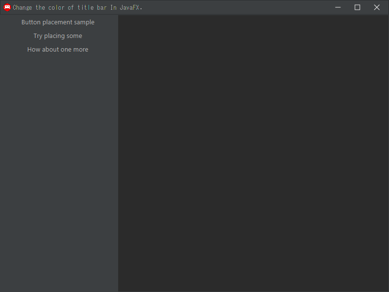

# ChangeColorTitlebar
Change the color of title bar in JavaFX.

# Sample

# Usage
You have to pass the path to javafx-sdk in VM Option.

`--module-path "javafx-sdk-17.0.10/lib" --add-modules javafx.controls,javafx.fxml`
